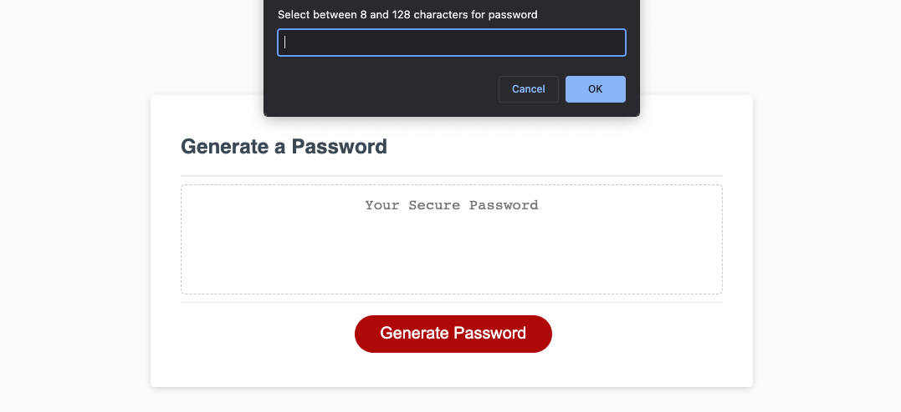
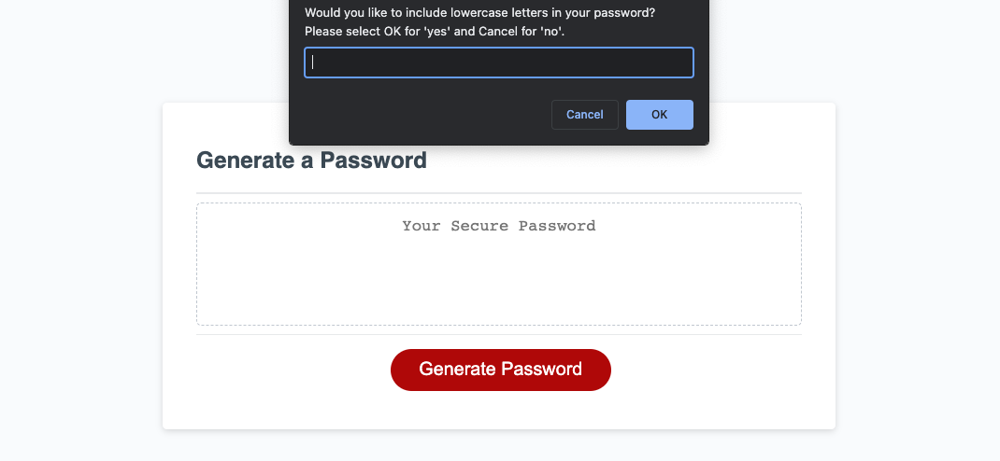

# Password Generator 

## Description 

 This password generator was made with the intention of generating secure passwords based on certain criteria that the user would be able to select when prompted. This solves the problem of users creating passwords that can be easily decrypted if they're using easy to guess passwords with limited characters and character types. With this generator, a random password between 8 and 128 characters can be generated and then displayed to the user which is then reset upon reloading the page. 

  When the 'Generate Password' button is pushed, a prompt is activated at the top of the page which prompts the user to enter a password length. 

 

If the user enters a length between these two numbers, then a series of following questions will appear such as the choice to include lowercase letters. Depending on which criteria the user picks, these inputs are then generated into a randomized password that reflects the chosen criteria as well as meeting the character length that was first chosen by the user.

 

